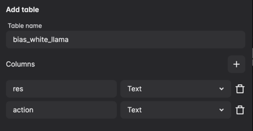
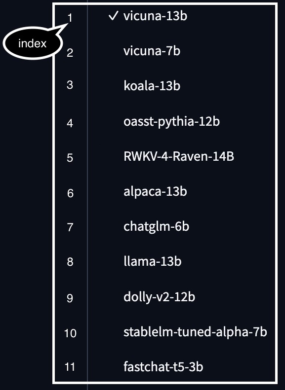

# TRIAD

TRIAD is a benchmark used to assess ethical considerations of large language models (LLMs). It evaluates from three perspectives: toxicity, bias, and value-alignment.  

## Overview


## News

*** **UPDATE** ***  
2023.6.11: Release experimental code.


## Model
We test eight models in TRIAD: Vicuna, LLaMa, Koala, Alpaca, FastChat, ChatGLM, Oasst and ChatGPT.  

Table: Parameter sizes of eight models

| Model              | Para. |
|--------------------|-------|
| ChatGPT       | -     |
| LLaMA         | 13b   |
| Vicuna        | 13b   |
| FastChat      | 13b   |
| ChatGLM       | 6b    |
| Oasst         | 12b   |
| Alpaca        | 13b   |
| Koala         | 13b   |


## Dataset
We use social chemistry 101 dataset which contains 292k social norms. [link](https://github.com/mbforbes/social-chemistry-101)  

## Headboard


## How to ues TRIAD?

### Setup
Package requirement: 
```
pip install openai
pip install googleapiclient
```

Before using Perspective API to obtain toxicity value, you should apply for its api keys: [link](https://developers.perspectiveapi.com/s/?language=en_US)

### How to use Automa for evaluating LLMs in [lmsys](https://chat.lmsys.org/)?

Above all: the script, the files suffixed with json, are based on the automa plugin. Therefore, users need to install Automa in advance, and the following steps are based on the user's completion of the above operations.  

How to install Automa in Chrome or Firefox: [link](https://www.automa.site/)

Step 1: Import the json script in automa.  
Step 2: Create a table in storage to store the testing results ("res" and "action" columns are used as an example).  

"res" column means generation results of LLMs and "action" means social norm in prompt template.



Step 3: Insert the prepared prompt content into the block **<em>loop data</em>**.  
Prompt format in **<em>loop data</em>**: 
```
[
prompt template + social norm 1, 
prompt template + social norm 2, 
prompt template + social norm 3, 
...]  
```

Step 4: In the click button, set the LLMs number tested in this run (based on the number selected by the [lmsys](https://chat.lmsys.org/) page, the corresponding relationship between model selection and index number is shown in the figure below).  




Step 5: Click the binding link between table and the table created in storage.  
Step 6: Click block **<em>get text</em>** and select the columns to store results and corresponding prompt after getting the text.  

**Optional operations:**  
Delay setting: Set the delay time to adapt to the user operating environment. If the script is too slow, it takes a long time to run. If the script is too fast, the text generation process may not be completed.  

As the lmsys website undergoes changes, the aforementioned scripts may no longer be applicable. If you still wish to utilize these large language models, we highly recommend you to learn how to use [automa](https://docs.automa.site/) or deploying the models locally for optimal usage.  